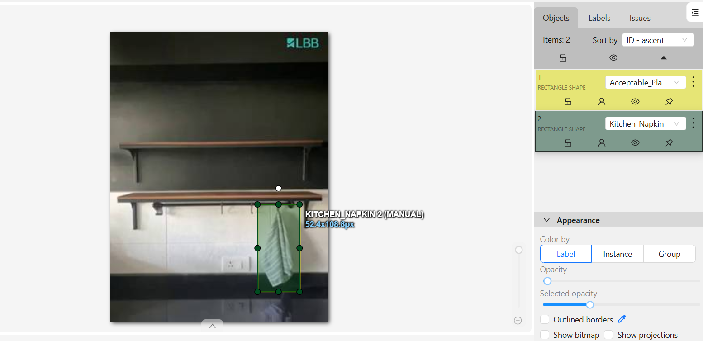

# ML_Video_annotation
CVAT video annotation project using a Kitchen shelf video dataset with atleast 500 frames, stowing ML pipelines – with strategic labeling, edge case documentation, and process improvement proposals.



## Project Overview 
Simulated Kitchen shelf stowing video annotation pipeline using CVAT, focusing on:
- **Placement Accuracy** (`Perfect_Placement`/`Faulty_Placement`)
- **Label Visibility** (Critical for barcode scanning)
- **Safety Risks** (`Shelf_Edge_Risk`, `Stacking_Violation`)

## Labeling Strategy
Developed 18 specialized labels including:
```python
labels = [
    "Perfect_Placement",  # Centered, label visible
    "Label_Glare",        # Light reflection obscuring barcode
    "Shelf_Edge_Risk",    # Item within 2cm of edge
    "Needs_second_look"  # Requires human review
]
```

CVAT Task Link: https://app.cvat.ai/tasks/1492168?page=1
